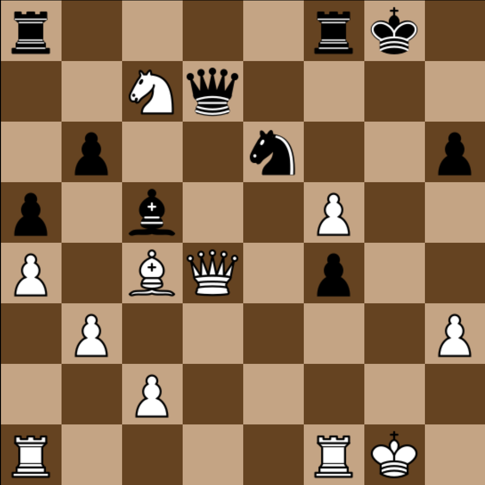
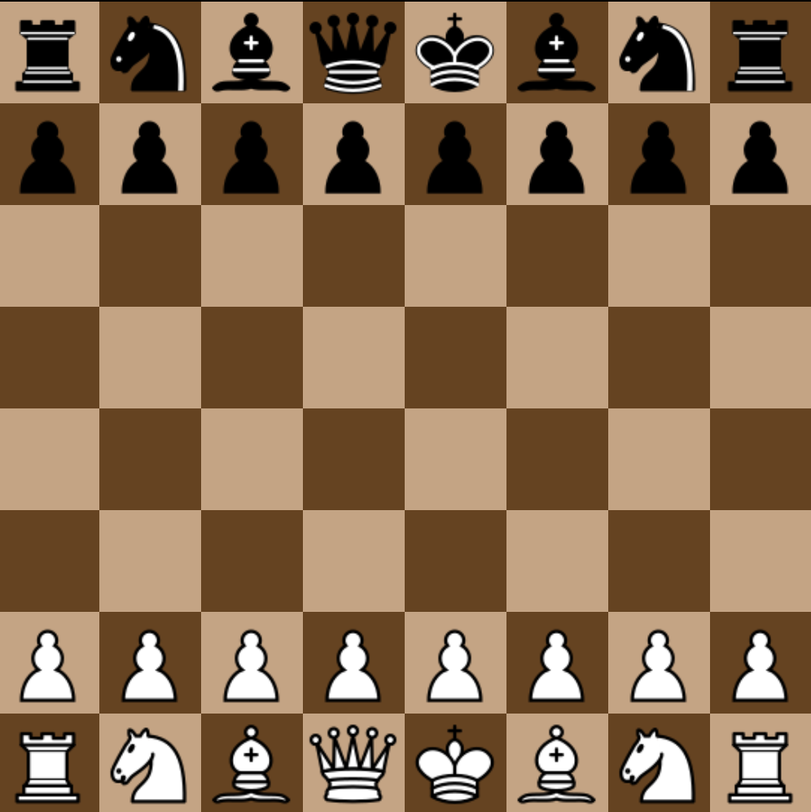
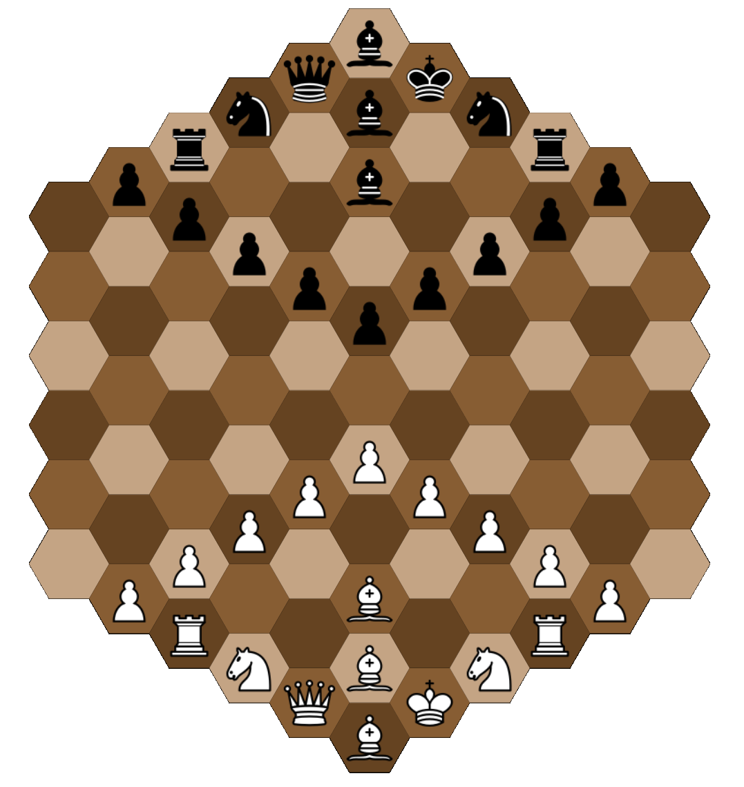
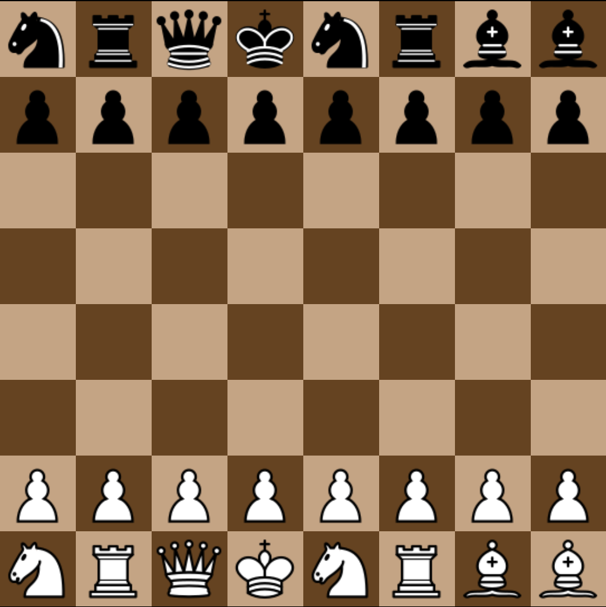

# Chess - made by Nubians for GameDev

Our team is called Nubians, comprised of Ashwin Abraham and Kartik Nair.
We have developed a game of Chess using JavaScript and HTML, which can be played on any Web Browser.

To play, you may either click [this link](https://k-rt-k.github.io/GameDev/index.html) or you may open index.html in any browser.

We have implemented three variations of chess - the standard variant, Fischer Random Chess (aka Chess 960), and Glinski's variant of Chess (which takes place on a Hexagonal Board). You may open Chessboard_main.html, Random.html or Chessboard_Hex.html in a browser to go directly to these variants.

We have implemented all the FIDE Rules of Chess, including Castling and En Passant.
On the standard variant and fischer variant, open the console to see the moves in algebraic chess notation!

# A still from a game of Chess

# The starting position of Standard Chess

# The starting position of Glinski's Variant

# A possible starting position of Fischer Random Chess
